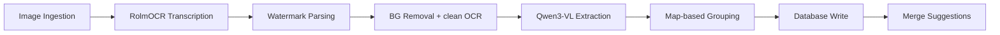
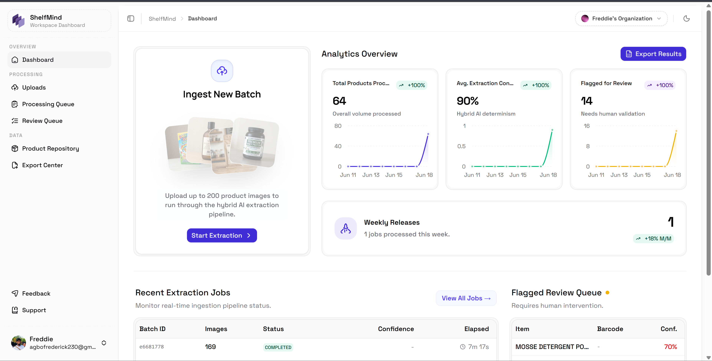

# ShelfMind — Pitch Deck

> **Sourcing rule (applies to the whole deck):** Every quantitative claim traces to a real source — repository data, `context/eval_results.json` (Part A), measured Qwen3-VL token usage (Part B), `context/architecture.md`, `context/Dataset Instruction.md`, or a cited public provider price. **No number in this deck is invented.** Where a measurement has not yet been produced, the slide says so explicitly ("pending evaluation" / "to be measured") rather than guessing.

---

## Slide 1 — Title

# ShelfMind
### AI image-to-IMDB master data, with confidence you can audit

A field agent photographs a product; ShelfMind reads the image and fills all **13 Item Master Database (IMDB) columns** with per-field confidence scores, ready for review and Excel/CSV export.

Built for the **GDSS-Maverick Hackathon** as a multi-tenant SaaS running entirely on Cloudflare's edge.

*Source: `README.md`, `context/project-overview.md`.*

---

## Slide 2 — Problem

Retail teams build the Item Master Database **by hand**, transcribing data from product photos and labels.

- Manual transcription is slow and inconsistent across hundreds of SKUs.
- Field photos are taken **on the shelf** — neighbouring products contaminate any naive OCR/vision read.
- Duplicates and conflicting entries accumulate with no audit trail.

A product that takes a human **5–10 minutes** to research and enter manually is the unit of work ShelfMind targets.

*Source: `context/project-overview.md` ("The Problem It Solves").*

---

## Slide 3 — Solution

**Upload images → AI extracts 13 IMDB fields → Review & edit flagged records → Export `predictions.xlsx`.**

ShelfMind is a **hybrid** pipeline, not a single model call:

- Deterministic **watermark tag parsing** anchors identity to ground truth, not AI guesses.
- **Background removal** isolates the product before reading it, killing shelf contamination.
- **Qwen3-VL** maps the clean label to the 13-column schema.
- **Per-field confidence** drives a human-in-the-loop review queue.

*Source: `README.md` ("How It Works"), `context/project-overview.md`.*

---

## Slide 4 — Pipeline (per image)



1. **OCR on original** (RolmOCR via Fireworks AI / Google Vision) — scans for the printed watermark tag; crops & re-OCRs all four edges as fallback.
2. **Background removal** (Cloudflare Images BiRefNet) — isolates the product; second OCR pass on the clean image.
3. **Qwen3-VL extraction** — clean image + OCR text → 13-column IMDB JSON. **Watermark values override** Qwen for `ITEM_NAME, WEIGHT, MANUFACTURER, COUNTRY, PACKAGING_TYPE`.
4. **Side-aware grouping** — multiple images per product merged by watermark tag → barcode → name; each side (Front/Back/Left/Right/Barcode) wins the fields it owns.

*Source: `README.md`, `context/architecture.md` (stages + watermark override rule, line 405), `src/types/pipeline.ts` (8-node graph).*

---

## Slide 5 — Differentiators

- **Deterministic watermark anchor** — a physical tag on each audit photo yields `auditId`, description, weight, side, manufacturer, country, packaging. These **override** the model, so grouping is anchored to ground truth, not inference. *(`context/project-overview.md` line 152, `context/architecture.md` line 405.)*
- **Shelf-decontamination by design** — background is stripped *before* extraction, so neighbour products can't bleed into fields. *(`context/project-overview.md`.)*
- **Never hallucinate** — fields below confidence **0.3** are forced to empty string; the dataset spec itself requires "leave it empty rather than guessing." *(`src/types/imdb.ts` `FIELD_EMPTY_THRESHOLD`, `context/Dataset Instruction.md` §7.)*
- **Real-time observability** — 8-node React Flow visualizer streamed live from a Durable Object over WebSockets. *(`README.md`, `context/project-overview.md` line 179.)*

---

## Slide 6 — Trust & Confidence

Each field carries a confidence score (0.0–1.0). Overall record confidence is a **weighted mean** using `FIELD_WEIGHTS`:

```
BARCODE 1.0 · ITEM_NAME 0.9 · BRAND 0.85 · MANUFACTURER 0.8 · WEIGHT 0.8
PACKAGING_TYPE 0.75 · COUNTRY 0.7 · TYPE 0.65 · VARIANT 0.65
FRAGRANCE_FLAVOR 0.6 · PROMOTION 0.5 · ADDONS 0.5 · TAGLINE 0.5
```

- Records below **0.75** overall are flagged **"Needs Review."**
- Fields below **0.3** are blanked — ShelfMind never invents a value.
- Full per-image extraction evidence (ZXing barcode, OCR text, Qwen JSON, watermark) is stored for audit.

*Source: `src/types/imdb.ts` (`FIELD_WEIGHTS`, `CONFIDENCE_THRESHOLD = 0.75`, `FIELD_EMPTY_THRESHOLD = 0.3`), `README.md` ("Confidence Scoring").*

---

## Slide 7 — Why Qwen3-VL

- **Default model:** `qwen3-vl-235b-a22b-instruct` (id `qwen3-vl-235b`), served via the **Alibaba Cloud** Qwen MaaS endpoint. *(`src/lib/models.ts` `VISION_MODELS`, `DEFAULT_VISION_MODEL_ID`.)*
- **Job:** map a *clean, isolated* product label + OCR text to a strict 13-column JSON schema — a vision-language task, not plain OCR.
- **Fit for the hybrid design:** Qwen handles open-ended label interpretation, while the deterministic watermark layer overrides it on the fields where a printed tag is authoritative — combining model flexibility with ground-truth precision.
- **Pluggable per job:** the extraction model is selectable from a registry — Qwen3-VL 235B / 30B / Qwen-VL-Max (Alibaba Cloud), plus GPT-4o and Gemini 2.0 Flash (via OpenRouter). The chosen id is stored on the job row; each model carries its own pricing for cost accounting (Slide 11). *(`src/lib/models.ts`.)*
- **Operational:** every response's `usage` object is parsed (`parseUsage`) and aggregated per job for real cost accounting (Slide 11). RolmOCR transcription runs separately via **Fireworks AI**.

*Source: `src/lib/models.ts`, `src/lib/pipeline.ts`.*

---

## Slide 8 — Architecture

Entirely on **Cloudflare's edge** — API, async processing, storage, and real-time state:

| Concern | Technology |
|---|---|
| API & async | Cloudflare **Workers** + **Queues** |
| Storage | **R2** (images, exports) |
| Structured data | **D1** (SQLite local / D1 prod) via **Drizzle ORM** |
| Cache | **KV** — extraction results, **7-day TTL** |
| Image processing | **Cloudflare Images** (BiRefNet background removal) |
| Real-time | **Durable Objects** + WebSockets (pipeline visualizer) |
| OCR | **RolmOCR** via **Fireworks AI** (Google Vision fallback) |
| Vision extraction | Selectable registry (`src/lib/models.ts`) — default **Qwen3-VL 235B** via **Alibaba Cloud** Qwen MaaS; GPT-4o / Gemini via OpenRouter |
| Auth & tenancy | **Better Auth** org plugin |
| Frontend | TanStack (Router/Query/Store/Table/Form) + shadcn/ui + Tailwind |

Multi-tenant: every D1 row carries `organisation_id`; R2/KV keys are org-namespaced; tenancy enforced at the **API layer**.

*Source: `context/architecture.md` (tech-stack table), `README.md` ("Multi-Tenancy", "Project Structure").*

---

## Slide 9 — Live Demo / Screenshot

**Dashboard screenshot:** `./public/dashboard.png` (present in the repo).



**Demo flow:**
`/dashboard/uploads` (drag-and-drop up to 20 images) → `/dashboard/processing-queue` (live status) → `/dashboard/jobs/:jobId` (8-node React Flow visualizer, WebSocket-streamed) → `/dashboard/review-queue` (edit flagged fields) → `/dashboard/exports` (Excel / CSV / JSON).

**8-node visualizer:** Image Ingestion → RolmOCR Transcription → Watermark Parsing → BG Removal → Qwen3-VL Extraction → Map-based Grouping → Database Write → Merge Suggestions.

> If presenting where the image cannot render, fall back to the Slide 4 mermaid diagram + the node walkthrough above.

*Source: `README.md` ("Pages"), `src/types/pipeline.ts`, `public/dashboard.png` (verified present).*

---

## Slide 10 — Results / Metrics (REAL data only)

### Dataset scope
**45 distinct products**, **3–4 images each**, **13 IMDB columns**. Not pre-split into train/test. *(`context/Dataset Instruction.md`.)*

### Measured per-stage latency *(`context/architecture.md` lines 430–444)*
| Stage | Speed |
|---|---|
| Watermark OCR (full image) | ~800 ms/image |
| Margin-crop fallback OCR | ~200 ms/edge × 4 (only if no tag found) |
| Background removal (BiRefNet) | ~100–300 ms/image |
| Clean OCR pass | ~800 ms/image (skipped if unchanged) |
| **Qwen3-VL extraction** | **~2–4 s/image** |
| KV cache hit (7-day TTL) | near-instant |
> **Batch:** first run ~**6–10 min** for a 20-image batch; cached re-runs near-instant. (`context/architecture.md` line 444.)

### Output completeness — computed directly from `context/output_results.xlsx - Sheet1.csv` (45 rows)
| Column | Filled | Column | Filled |
|---|---|---|---|
| ITEM_NAME | 45/45 (100%) | COUNTRY | 26/45 (57.8%) |
| BARCODE | 43/45 (95.6%)¹ | TYPE | 23/45 (51.1%) |
| MANUFACTURER | 45/45 (100%) | VARIANT | 2/45 (4.4%)² |
| BRAND | 45/45 (100%) | FRAGRANCE_FLAVOR | 26/45 (57.8%)² |
| WEIGHT | 45/45 (100%) | PROMOTION | 3/45 (6.7%)² |
| PACKAGING_TYPE | 45/45 (100%) | ADDONS | 4/45 (8.9%)² |
| | | TAGLINE | 11/45 (24.4%) |

- **All 5 critical identity fields** (BARCODE, ITEM_NAME, BRAND, MANUFACTURER, WEIGHT) filled on **43/45 products (95.6%)**.
- ¹ 39/45 (86.7%) of barcodes are full 13-digit strings.
- ² Sparse columns are **expected**: the dataset spec marks VARIANT/FRAGRANCE_FLAVOR/PROMOTION/ADDONS as "empty if not applicable," and ShelfMind blanks low-confidence fields by design. Low fill here reflects *applicability*, not extraction failure.

### Accuracy
**Pending evaluation against provided ground truth.** The official ground-truth Excel is **not** committed to the repo, so `context/eval_results.json` has not been produced. `src/scripts/evaluate.ts` (Part A) will compute per-column accuracy, overall accuracy across all 13 columns, and a fully-correct-product count **the moment** a ground-truth file is supplied — it **fails loudly** rather than fabricating scores. *No accuracy percentage is shown because none has been measured.*

### Cost
**Dollar figure: N/A — to be measured.** The pipeline now captures the real `usage` (input/output tokens) from every vision call and computes & persists a per-job `totalCost` (`src/lib/models.ts` + `src/lib/pipeline.ts`). No live run has been executed against this dataset in-session, so **no measured token count or dollar total is reported here** — the actual figure populates automatically on the next keyed run. The pricing used is the **approximate public list price** in `models.ts` (explicitly "not a billing source of truth"). See Slide 11.

---

## Slide 11 — Cost Methodology (Part B)

ShelfMind records the **measured** token usage that every vision response returns (previously discarded) and turns it into a per-job cost:

- `extractWithQwen` and `extractWatermarkWithQwen` return a normalized `usage` via `parseUsage` (`{ inputTokens, outputTokens }`).
- A per-job `CostAccumulator` aggregates usage across all calls (`addUsage`), and the cost is computed per the selected model's pricing:
  **`cost = inputTokens/1e6 × inputPer1M + outputTokens/1e6 × outputPer1M`** (`computeCost`).
- The job row persists `visionModel` and `totalCost`; the pipeline logs e.g. *"Token usage: X in / Y out — est. cost $Z on <model label>"*.
- Each registry model carries its own pricing table (`src/lib/models.ts` `ModelPricing`), so a frontier-model comparison falls out of the same run by switching `visionModel` (e.g. Qwen3-VL 235B vs GPT-4o vs Gemini 2.0 Flash).

> **Pricing caveat:** the `pricing` figures in `models.ts` are **approximate public list prices**, explicitly documented as *"not a billing source of truth."* Any quoted dollar figure or frontier comparison must therefore be labelled *figures from public provider pricing as of [date]* and confirmed against the provider before use. This deck quotes **no specific dollar total** because none has been measured in-session.

*Source: `src/lib/models.ts` (`VISION_MODELS`, `ModelPricing`, `parseUsage`, `computeCost`, `formatCost`), `src/lib/pipeline.ts` (`CostAccumulator`, `addUsage`, per-job `totalCost`).*

---

## Slide 12 — Judges' Focus Areas

- **Accuracy methodology:** real, reproducible eval harness (`src/scripts/evaluate.ts`) using the *same* normalization as the live pipeline (`src/lib/normalization.ts`) — per-column + overall accuracy + fully-correct count, written to `context/eval_results.json`. Fails loudly without ground truth (no fabricated scores).
- **No-hallucination guarantee:** confidence thresholds blank uncertain fields (`FIELD_EMPTY_THRESHOLD = 0.3`); spec-compliant "empty rather than guess."
- **Auditability:** watermark override + full per-image extraction evidence stored per record.
- **Engineering depth:** end-to-end Cloudflare edge stack, real-time Durable-Object observability, multi-tenant isolation, 7-day KV caching.
- **Honest metrics:** measured latency + output completeness today; accuracy & cost wired and clearly marked pending/to-be-measured.

---

## Slide 13 — Roadmap & Closing

### Roadmap
- **Run the measured eval:** add the official ground-truth Excel → generate `context/eval_results.json` → publish real per-column & overall accuracy.
- **Run a measured cost pass:** execute a live keyed batch to record real per-job `totalCost`, confirm the `models.ts` pricing against current public provider pricing, and publish a dated frontier comparison by re-running across `visionModel` options.
- Expand normalization coverage and duplicate-detection heuristics.
- Harden the review queue for high-volume field teams.

### Ask / What we need from you
- The **ground-truth Excel** (`context/ground_truth.xlsx`) to unlock the accuracy slide.
- A green light for a **live cost run** to replace "to be measured" with a real figure.

### Closing
ShelfMind turns a 5–10 minute manual transcription into a reviewed, audit-ready IMDB record — built on a hybrid, never-hallucinate pipeline where **every claim is grounded in real data, and anything unmeasured is labelled, not invented.**
