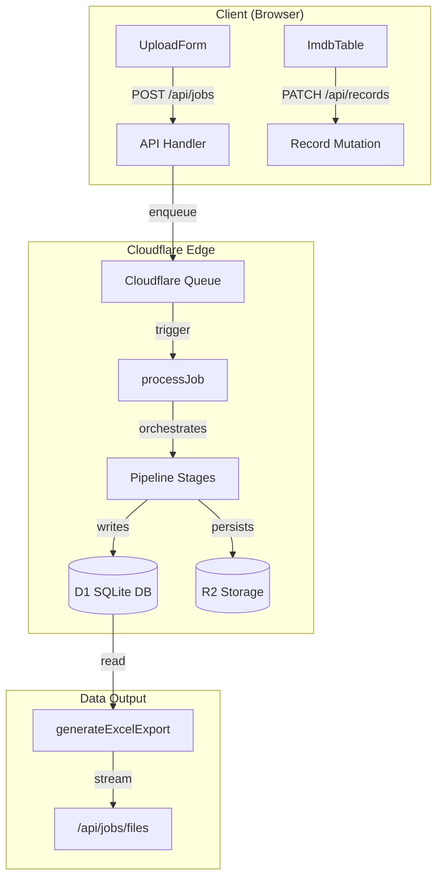

# ShelfMind

ShelfMind is a full-stack, AI-powered image-to-item master data tool designed for retail teams to automate the population of Item Master Databases (IMDB). It transforms physical product photographs into structured, 13-column digital records using a multi-stage extraction pipeline involving OCR, Vision Language Models (VLMs), and deterministic watermark parsing.

Built as a multi-tenant SaaS, ShelfMind provides isolated workspaces where members can manage jobs, review extracted data, and export clean catalogs ready for enterprise ingestion.

## Features

- **Multi-Stage AI Extraction Pipeline**: OCR → Watermark Parsing → Background Removal → Qwen3-VL Extraction → Side-Aware Grouping → Database Write
- **Physical Watermark Tag Parsing**: Deterministic extraction of audit identity, product description, weight, side, manufacturer, and country from printed tags
- **AI Background Removal**: Cloudflare Images BiRefNet segmentation strips shelf/store environment from product images
- **Side-Label Intelligence**: Confidence boosting based on image side (Front/Back/Left/Right/Barcode) for accurate field mapping
- **Real-time Pipeline Visualizer**: Live React Flow visualization streaming from Durable Objects via WebSockets
- **Multi-Tenant Architecture**: Organisation-scoped workspaces with role-based access control
- **Duplicate Detection**: Pre-calculated asynchronous duplicate detection with merge/dismiss workflow
- **Export Options**: Excel (.xlsx), CSV, and JSON exports with org-scoped history

## Tech Stack

| Layer | Technology |
|-------|------------|
| **Framework** | TanStack Start (Vite + React) |
| **Routing** | TanStack Router |
| **Authentication** | Better Auth (organisation plugin + Google OAuth) |
| **Database** | Cloudflare D1 (SQLite) w/ Drizzle ORM |
| **Storage** | Cloudflare R2 |
| **Background Tasks** | Cloudflare Queues |
| **Real-time** | Durable Objects + WebSockets |
| **Image Processing** | Cloudflare Images (BiRefNet AI) |
| **OCR** | RolmOCR via Fireworks AI / Google Vision |
| **Vision AI** | Qwen3-VL via Fireworks AI |
| **Runtime** | Bun |

## Installation

### Prerequisites

- Node.js (via Bun runtime)
- Cloudflare account with Workers, D1, R2, KV, and Images enabled
- Fireworks AI API key (for RolmOCR and Qwen3-VL)

### Setup

1. Clone the repository:
```bash
git clone https://github.com/Gaius-1/shelfmind.git
cd shelfmind
```

2. Install dependencies:
```bash
bun install
```

3. Configure environment variables:
```bash
cp wrangler.jsonc.example wrangler.jsonc
# Edit wrangler.jsonc with your Cloudflare bindings and API keys
```

4. Run local development:
```bash
bun dev
```

5. For production deployment:
```bash
bun run deploy
```

## Usage

### Core User Flow

1. **Upload**: Submit batches of up to 20 images (JPG, PNG, WEBP) via the upload form
2. **Extract**: Background pipeline processes images through five stages including background removal and Qwen2.5-VL extraction
3. **Review**: Extracted records are presented in a review queue where users can perform inline edits and resolve duplicate flags
4. **Export**: Cleaned data is exported as an Excel workbook (`predictions.xlsx`)

### Navigation

The application is organized into four main sections:

- **Overview**: Dashboard with analytics and recent activity
- **Processing**: Uploads, Processing Queue, Pipeline Visualizer, Review Queue
- **Data**: Product Repository, Duplicates
- **Exports**: Export Center with download history

## Architecture

ShelfMind runs entirely on Cloudflare's global edge network for high performance and low latency.

### Data Flow



### Pipeline Stages

1. **OCR on Original Image**: Watermark detection using RolmOCR or Google Vision
2. **Background Removal**: Cloudflare Images BiRefNet segmentation
3. **Qwen3-VL Extraction**: Maps clean product label to 13-column IMDB schema
4. **Side-Aware Grouping**: Confidence-boosted aggregation with conflict guards
5. **Database Write**: Merged records written to D1
6. **Post-Job Duplicate Detection**: Asynchronous comparison against existing records

## Multi-Tenancy

Every piece of data in ShelfMind is scoped to an organisation, enforced at the API layer. Data isolation is achieved through:

- D1 tables with `organisation_id` columns
- R2 keys namespaced by organisation
- KV cache keys scoped to organisation
- Session-based organisation context

## Contributing

Contributions are welcome!.

## License

[Specify your license here]

---
